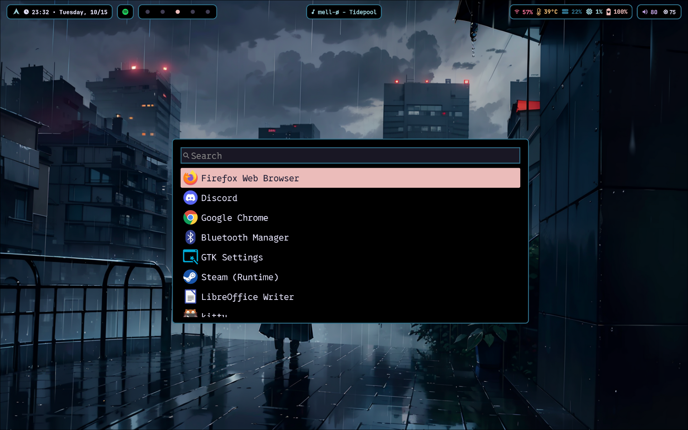
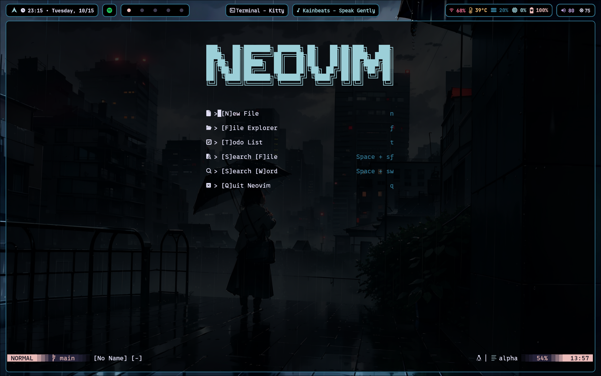
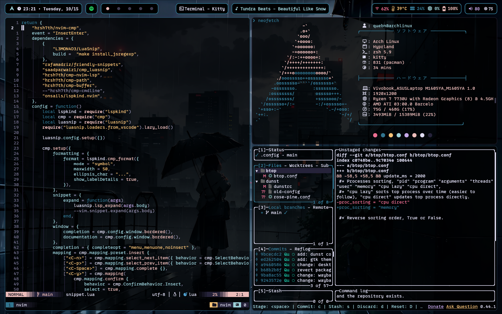
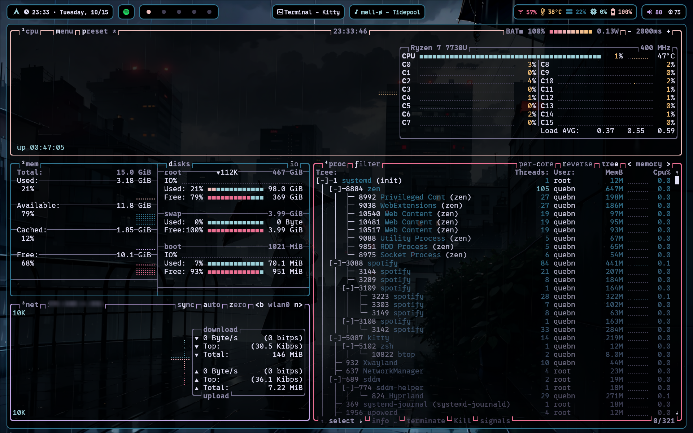
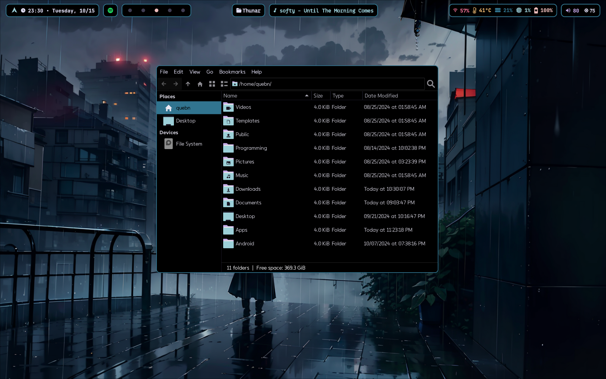
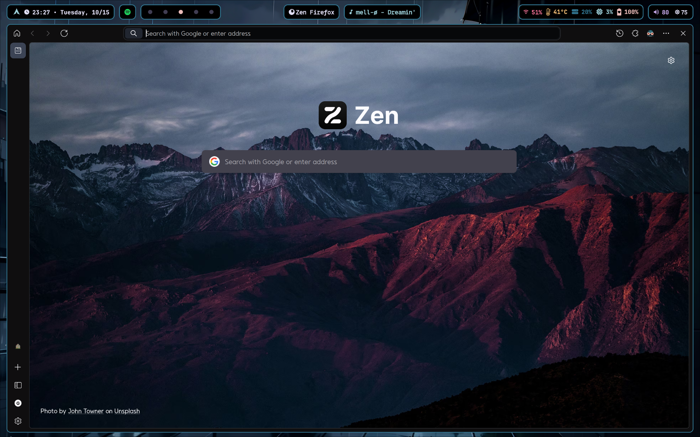
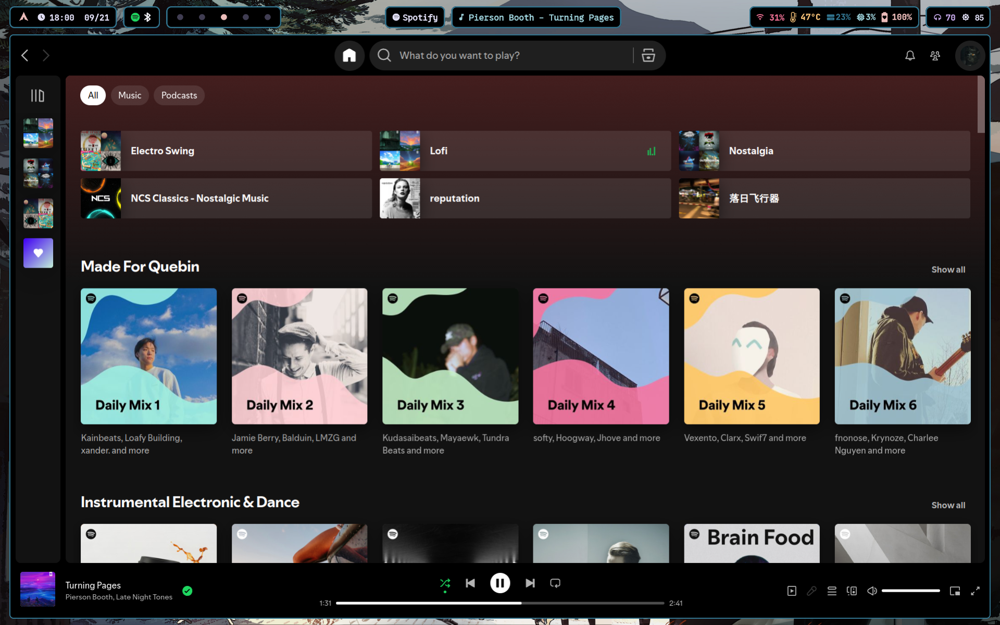

# My Dotfiles
My dotfiles for linux, heavily themed around rose-pine.

> [!CAUTION]
> This repository has some config and scripts that may break some defaults.\
> Do not clone if not the owner of this repository. 

## What I use ATM.
- Tiling Window Manager: [Hyprland](https://hyprland.org/)
- Status Bar: [Waybar](https://github.com/Alexays/Waybar)
- Text Editor: [Neovim](https://github.com/neovim/neovim)
- Terminal: [kitty](https://github.com/kovidgoyal/kitty)
- Shell: Zsh (with [p10k](https://github.com/romkatv/powerlevel10k))
- Launcher: [wofi](https://hg.sr.ht/~scoopta/wofi)

## Screenshots
Wallpaper w/ Waybar

Wofi

Neovim w/ Kitty

Neovim, Neofetch, and Lazygit

Process Manager

Thunar File Manager

Browser

Spotify

